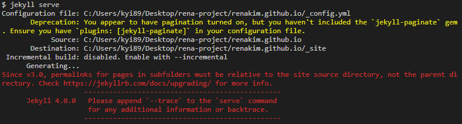

# 테마 변경 과정

Clean blog 테마 -> lanyon 테마

## 브랜치 생성 및 테마 코드 적용

1. 테마 repo clone
2. 기존 .github.io repo에서 브랜치 생성
3. 새 브랜치에서, (본인이 직접 작성/추가한) 테마 외의 컨텐츠를 제외한 모든 파일 제거
4. clone 해온 새 테마 파일을 복사하여 새 브랜치로 복사해줌

그리고 바로 jekyll serve를 해 보니 아래와 같은 에러가 발생함

<!--  -->

## Jekyll commands

1. 명령 수행

```
$  gem install jekyll
Fetching jekyll-4.0.0.gem
Fetching sassc-2.2.1-x64-mingw32.gem
Fetching jekyll-sass-converter-2.1.0.gem
Fetching kramdown-2.1.0.gem
Fetching kramdown-parser-gfm-1.1.0.gem
Successfully installed sassc-2.2.1-x64-mingw32
Successfully installed jekyll-sass-converter-2.1.0
Successfully installed kramdown-2.1.0
Successfully installed kramdown-parser-gfm-1.1.0
-------------------------------------------------------------------------------------
Jekyll 4.0 comes with some major changes, notably:

  * Our `link` tag now comes with the `relative_url` filter incorporated into it.
    You should no longer prepend `{{ site.baseurl }}` to ``
    For further details: https://github.com/jekyll/jekyll/pull/6727

  * Our `post_url` tag now comes with the `relative_url` filter incorporated into it.
    You shouldn't prepend `{{ site.baseurl }}` to ``
    For further details: https://github.com/jekyll/jekyll/pull/7589

  * Support for deprecated configuration options has been removed. We will no longer
    output a warning and gracefully assign their values to the newer counterparts
    internally.
-------------------------------------------------------------------------------------
Successfully installed jekyll-4.0.0
Parsing documentation for sassc-2.2.1-x64-mingw32
Installing ri documentation for sassc-2.2.1-x64-mingw32
Parsing documentation for jekyll-sass-converter-2.1.0
Installing ri documentation for jekyll-sass-converter-2.1.0
Parsing documentation for kramdown-2.1.0
Installing ri documentation for kramdown-2.1.0
Parsing documentation for kramdown-parser-gfm-1.1.0
Installing ri documentation for kramdown-parser-gfm-1.1.0
Parsing documentation for jekyll-4.0.0
Installing ri documentation for jekyll-4.0.0
Done installing documentation for sassc, jekyll-sass-converter, kramdown, kramdown-parser-gfm, jekyll after 16
seconds
5 gems installed
```

다시 serve 명령을 주니 아래와 같이 에러가 난다.

```
$ jekyll serve
Configuration file: C:/Users/kyi89/Desktop/rena-project/renakim.github.io/_config.yml
            Source: C:/Users/kyi89/Desktop/rena-project/renakim.github.io
       Destination: C:/Users/kyi89/Desktop/rena-project/renakim.github.io/_site
 Incremental build: disabled. Enable with --incremental
      Generating...
Since v3.0, permalinks for pages in subfolders must be relative to the site source directory, not the parent directory. Check https://jekyllrb.com/docs/upgrading/ for more info.
                    ------------------------------------------------
      Jekyll 4.0.0   Please append `--trace` to the `serve` command
                     for any additional information or backtrace.
                    ------------------------------------------------
```

찾아보니 아래 내용이 나옴.

> Jekyll 3 부터, 상대적 고유주소는 사용을 권장하지 않는 기능으로 결정되었습니다. 당신의 사이트가 Jekyll 2 또는 그 이하의 버전에서 생성되었다면, serve 또는 build 시 다음과 같은 에러가 발생할 수 있습니다:
>
> > Since v3.0, permalinks for pages in subfolders must be relative to the site
> > source directory, not the parent directory. Check
> > https://jekyllrb.com/docs/upgrading/ for more info.
> > 당신의 \_config.yml 아리에서 다음 내용을 제거하면 이 에러는 해결됩니다:
> > relative_permalinks: true

https://jekyllrb-ko.github.io/docs/upgrading/2-to-3/#%EC%83%81%EB%8C%80%EC%A0%81-%EA%B3%A0%EC%9C%A0%EC%A3%BC%EC%86%8C-%EA%B8%B0%EB%8A%A5-%EC%A0%9C%EA%B1%B0

일단 config.yaml에서 아래 옵션을 주석처리 했다.
`relative_permalinks: true`
